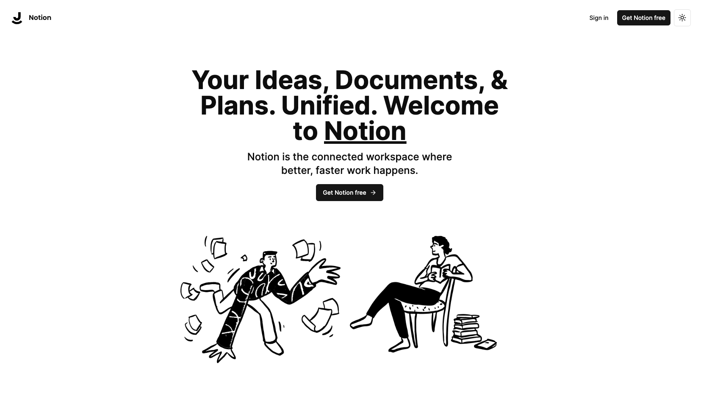
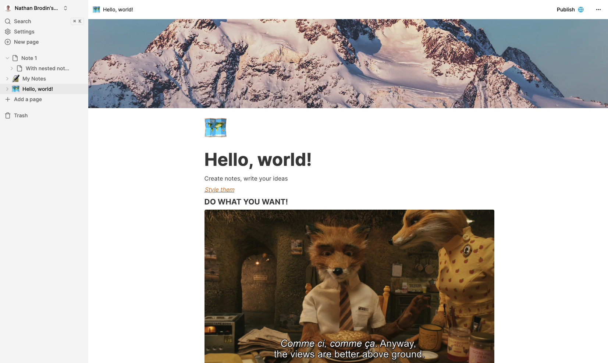

<div align="center">

# Notion
**Your Ideas, Documents, & Plans. Unified. Welcome to Notion**

</div>



A Notion clone built with [Next.js](https://nextjs.org/) and [Tailwind CSS](https://tailwindcss.com/).

Notion is a note-taking and collaboration application with markdown support, and this project aims to replicate its core features.

Share your ideas, documents, and plans with your team, and keep everything in one place.



## Key Features:

- Real-time database
- Notion-style editor
- Light and Dark mode
- Infinite children documents
- Trash can & soft delete
- Authentication
- File upload
- File deletion
- File replacement
- Icons for each document (changes in real-time)
- Expandable sidebar
- Full mobile responsiveness
- Publish your note to the web
- Fully collapsable sidebar
- Landing page
- Cover image of each document
- Recover deleted files

## Tech Stack

- [TypeScript](https://www.typescriptlang.org/), a typed superset of JavaScript
- [Next.js](https://nextjs.org/), a React framework
- [Tailwind CSS](https://tailwindcss.com/), a utility-first CSS framework
- [shadcn/ui](https://ui.shadcn.com/), a UI component library
- [Clerk](https://clerk.com/), an authentication library
- [Convex](https://www.convex.dev/), a serverless backend
- [Edge Store](https://edgestore.dev/), a serverless database to store blobs
- [Bun](https://bun.sh/), a build tool
- [Zustand](https://zustand-demo.pmnd.rs/), a state management library
- [Trunk](https://trunk.io/), a code quality / security checking tool

Deployed on [Vercel](https://vercel.com/), backend on [Convex](https://www.convex.dev/) and [Edge Store](https://edgestore.dev/).

## Getting Started

These instructions will get you a copy of the project up and running on your local machine for development and testing purposes.

1. Clone the repository

```bash
git clone https://github.com/NathanBrodin/Notion.git
cd Notion
```

2. Install the dependencies

(Install [Bun](https://bun.sh/) if you haven't already), or use npm or yarn
```bash
curl -fsSL https://bun.sh/install | bash
```
Then install the dependencies

```bash
bun install
```

3. Set up the environment variables

Create a `.env.local` file in the root of the project and add the following environment variables:
```bash
CONVEX_DEPLOYMENT=''

NEXT_PUBLIC_CONVEX_URL=''

NEXT_PUBLIC_CLERK_PUBLISHABLE_KEY=''
CLERK_SECRET_KEY=''

EDGE_STORE_ACCESS_KEY=''
EDGE_STORE_SECRET_KEY=''
```

For this, you will need to deploy a Convex backend and an Edge Store database.
You can find the instructions for that in the [Convex documentation](https://docs.convex.dev/quickstart/nextjs) the [Edge Store documentation](https://edgestore.dev/docs/quick-start) and the [Clerk Documentation](https://clerk.com/docs/quickstarts/nextjs).

This will allow you to get your environment variables for the `.env.local` file.

4. Run the backend server

```bash
bunx convex dev
```

5. Run the frontend server

```bash
bun run dev
```

6. Open [http://localhost:3000](http://localhost:3000) with your browser to see the result.

## License
This project is licensed under the MIT License - see the [LICENSE](LICENSE) file for details.

## Acknowledgements

Made using [Code With Antonio](https://www.youtube.com/watch?v=0OaDyjB9Ib8)'s tutorial.
