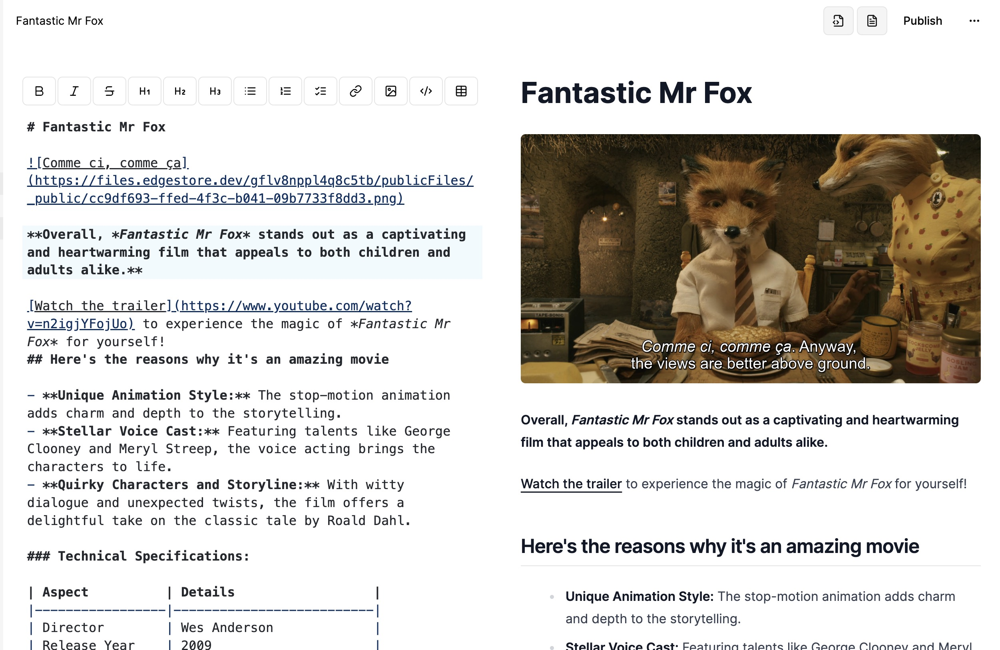

<div align="center">

# Write

**Capture, Collaborate, Create. Welcome to Write is your all-in-one platform for seamless collaboration and creativity.**

</div>


Write is a powerful Markdown editor that allows you to write, edit, and share your documents with everyone.


Start by creating a new project, using a available template or starting from scratch. Next, you can write your document using the powerful Markdown editor. You can also add images, videos, and other files to your document.

If you are lost using Markdown, you can use the built-in Markdown toolbar to help you out.

To get a look at your document, you can use the preview mode to see how your document will look like when published, on the top right of the screen.

Once you are all done, you can pusblish your document to the web, and share it with everyone! You can also export your document to a PDF file.



## Key Features:

- Real-time database
- Notion-style look and feel
- Publish your documents to the web
- Export your documents to a PDF file
- Trash can & soft delete, with recovery
- File upload
- Light and Dark mode
- Full mobile responsiveness
- Authentication
- Expandable sidebar
- Fully collapsable sidebar
- Landing page

## Tech Stack

- [TypeScript](https://www.typescriptlang.org/), a typed superset of JavaScript
- [Next.js](https://nextjs.org/), a React framework
- [Tailwind CSS](https://tailwindcss.com/), a utility-first CSS framework
- [shadcn/ui](https://ui.shadcn.com/), a UI component library
- [Clerk](https://clerk.com/), an authentication library
- [Convex](https://www.convex.dev/), a serverless backend
- [Edge Store](https://edgestore.dev/), a serverless database to store blobs
- [Bun](https://bun.sh/), a build tool
- [Zustand](https://zustand-demo.pmnd.rs/), a state management library
- [Trunk](https://trunk.io/), a code quality / security checking tool

Deployed on [Vercel](https://vercel.com/), backend on [Convex](https://www.convex.dev/) and [Edge Store](https://edgestore.dev/).

## Getting Started

These instructions will get you a copy of the project up and running on your local machine for development and testing purposes.

1. Clone the repository

```bash
git clone https://github.com/NathanBrodin/Write.git
cd Write
```

2. Install the dependencies

(Install [Bun](https://bun.sh/) if you haven't already), or use npm or yarn

```bash
curl -fsSL https://bun.sh/install | bash
```

Then install the dependencies

```bash
bun install
```

3. Set up the environment variables

Create a `.env.local` file in the root of the project and add the following environment variables:

```bash
CONVEX_DEPLOYMENT=''

NEXT_PUBLIC_CONVEX_URL=''

NEXT_PUBLIC_CLERK_PUBLISHABLE_KEY=''
CLERK_SECRET_KEY=''

EDGE_STORE_ACCESS_KEY=''
EDGE_STORE_SECRET_KEY=''
```

For this, you will need to deploy a Convex backend and an Edge Store database.
You can find the instructions for that in the [Convex documentation](https://docs.convex.dev/quickstart/nextjs) the [Edge Store documentation](https://edgestore.dev/docs/quick-start) and the [Clerk Documentation](https://clerk.com/docs/quickstarts/nextjs).

This will allow you to get your environment variables for the `.env.local` file.

4. Run the backend server

```bash
bunx convex dev
```

5. Run the frontend server

```bash
bun run dev
```

6. Open [http://localhost:3000](http://localhost:3000) with your browser to see the result.

## License

This project is licensed under the MIT License - see the [LICENSE](LICENSE) file for details.

## Acknowledgements

Original code made using [Code With Antonio](https://www.youtube.com/watch?v=0OaDyjB9Ib8)'s tutorial, which is a Notion Clone. I have then modified it to fit my needs and added a lot of new features!
